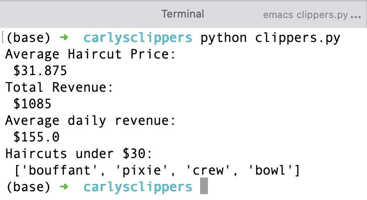

# Carly's Clippers

### What does it do ?
> Prints information a haircut business.
> Do a bit of calculation on averages and reduction of prices on haircuts.

### How does it looks ?
> 

### How do i use it ?
> No input is taken in so just need to run it and watch ;)
> There are few solutions that you can uncomment.
> You can also modify it as you please !

### How was it done ?
> Using Emacs, the CLI and Python

### Why ?
> Loop project training, also trained my comments skills.

